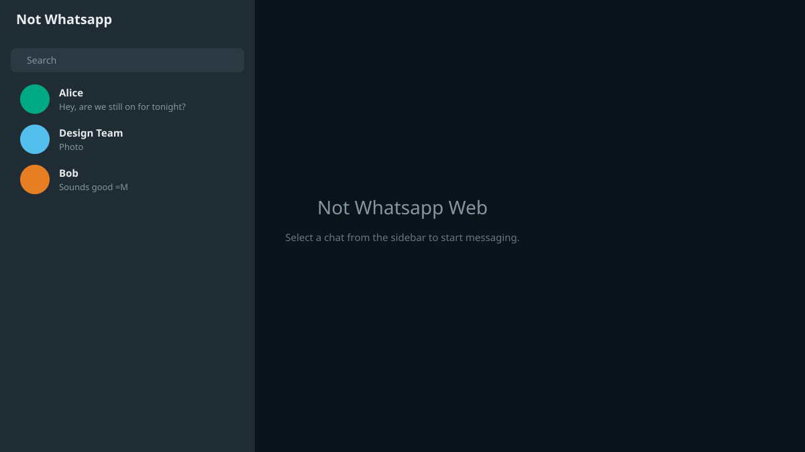
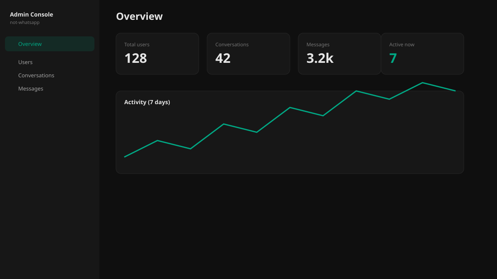

# Not WhatsApp

A real-time messaging app inspired by WhatsApp — direct and group chats, statuses, read receipts, and an admin moderation panel — built with **Next.js**, **Convex**, and **Clerk**.

> **Live demo:** Add your deployed URL here after following [Deployment](#deployment).





## What I built

- **Real-time messaging** — 1:1 and group chats with text, images, replies, forwards, and @mentions
- **WhatsApp-style UX** — archive, pin, favorites, unread filters, per-user delete, block users
- **Statuses** — 24-hour ephemeral text/image updates with seen/unseen rings
- **Presence** — online / last seen via heartbeat
- **Read receipts** — sent, delivered, and read ticks on direct chats
- **Admin console** — user bans, conversation and message oversight, platform stats
- **Dark mode** — system-aware theme toggle

## Tech stack

| Layer | Technology |
|-------|------------|
| Frontend | Next.js 16 (App Router), React 19, Tailwind CSS |
| Backend | [Convex](https://convex.dev) — real-time database & server functions |
| Auth | [Clerk](https://clerk.com) |
| UI | shadcn/ui, Lucide icons, Fancybox |

## Architecture

```
Browser (Next.js)
    │
    ├── Clerk ──────────────► Sign-in / session JWT
    │
    └── Convex React client ─► Subscribes to queries (live updates)
            │
            ▼
        Convex backend
            ├── users          (profile, roles, bans, lastSeen)
            ├── conversations  (direct + group metadata)
            ├── conversationMembers
            ├── messages       (paginated per conversation)
            ├── conversationStates (per-user pin/archive/read/delete)
            ├── blocks, statuses, statusViews
            └── admin queries  (platform-wide moderation)
```

**Auth flow:** Clerk issues a JWT on sign-in. The Convex client passes it on every request. `getCurrentUser()` resolves the Convex `users` row via `tokenIdentifier`. All mutations verify membership before reads/writes.

**Real-time:** Convex queries (`conversations.list`, `messages.list`) are reactive — when a message is inserted, every subscribed client updates automatically. No WebSocket code on the frontend.

**Per-user state:** Conversations are shared documents; archive/pin/read/delete is stored in `conversationStates` scoped by `userId`, matching WhatsApp's per-device behaviour.

## Technical highlights

- **Cursor-based pagination** for message history (`usePaginatedQuery`)
- **Membership as source of truth** — `conversationMembers` table for both direct and group chats
- **Block enforcement on send** — `assertNotBlocked` before message insert in direct chats
- **Denormalized reply snapshots** — `replyTo` embeds sender/type/text so replies render after original deletion
- **Ban gate** — `assertNotBanned` on writes; `BannedGate` component for UI lockout
- **Admin RBAC** — `role: "admin"` on users; `getCurrentAdmin()` on all admin functions

## Getting started

### Prerequisites

- Node.js 20+
- [pnpm](https://pnpm.io) (or npm)
- A [Clerk](https://clerk.com) application
- A [Convex](https://convex.dev) project

### 1. Clone and install

```bash
git clone https://github.com/odilson-dev/whatsapp-clone.git
cd not-whatsapp
pnpm install
```

### 2. Environment variables

Copy the example file and fill in your values:

```bash
cp .env.example .env.local
```

See `.env.example` for all required keys.

### 3. Run Convex and Next.js

In one terminal:

```bash
npx convex dev
```

In another:

```bash
pnpm dev
```

Open [http://localhost:3000](http://localhost:3000).

### 4. Create an admin user

After signing up, promote your account in the Convex dashboard (Functions → `admin:makeAdminByEmail`) or run the internal mutation with your email.

## Deployment

See [docs/DEPLOYMENT.md](docs/DEPLOYMENT.md) for step-by-step Vercel + Convex production setup.

Quick checklist:

1. `npx convex deploy` — production Convex deployment
2. Set Convex env: `CLERK_FRONTEND_API_URL`
3. Deploy Next.js to Vercel with `NEXT_PUBLIC_CONVEX_URL`, Clerk keys
4. Add production URLs to Clerk allowed origins
5. Update the live demo link in this README

## Screenshots

Place captures in `docs/screenshots/` (see `docs/screenshots/README.md`). SVG previews are included; replace with PNGs for a stronger portfolio impression:

- `chat-list` — sidebar with conversations
- `group-chat` — active group thread
- `admin` — admin dashboard overview

## Project structure

```
app/                    Next.js routes (chat, admin, profile, auth)
components/chat/        Chat UI (split into focused modules)
convex/                 Backend schema, queries, mutations
  lib/                  Shared auth, membership, block helpers
docs/                   Deployment guide & screenshots
```

## Scripts

```bash
pnpm dev        # Start Next.js dev server
pnpm build      # Production build
pnpm start      # Start production server
pnpm lint       # ESLint
pnpm typecheck  # TypeScript check
```

## Contributing

Want to fix a bug or hit an error while setting up? See **[CONTRIBUTING.md](CONTRIBUTING.md)** for local setup, PR guidelines, and a troubleshooting table for common Clerk / Convex / Next.js issues.

## License

MIT — see [LICENSE](LICENSE). You may reuse, modify, and share this project freely.
